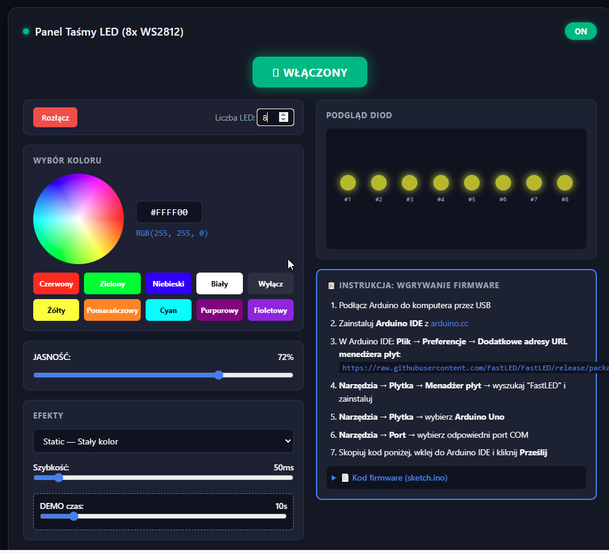

# Web-to-USB-WS2812-Control-Center-with-Arduino

[English](#english) | [Polski](#polski)



---

## English

Universal web UI (Web Serial API) + Arduino firmware for real-time WS2812/NeoPixel LED control. Features Dark Mode, FastLED effects, color picker & live USB control without re-flashing.

### Features

- Web panel with color wheel, presets, brightness/speed sliders
- Live LED preview in the UI
- 10+ built-in FastLED effects
- DEMO mode with automatic effect switching
- Web Serial API connection (Chrome, Edge, Opera) — no extra drivers
- Firmware code available directly in the panel (copy button)
- Up to 256 WS2812B LEDs on a single digital pin
- Default data pin: **D3** (Arduino Uno)

### Hardware Requirements

- Arduino Uno (or compatible ATmega328P board)
- WS2812B / NeoPixel strip or ring
- 5V power supply (USB is enough for short strips; use external 5V for longer ones)
- USB-A → B cable

### Wiring

| WS2812B | Arduino Uno |
|---------|-------------|
| VCC (5V) | 5V or VIN |
| GND | GND |
| DIN (Data In) | **D3** |

> **Note:** WS2812B GND must be connected to Arduino GND. Without it, noise and unstable LED behavior may occur.

### Software Setup

#### 1. Arduino IDE

- Download [Arduino IDE](https://www.arduino.cc/en/software)
- Install and launch

#### 2. FastLED

In Arduino IDE:
`File → Preferences → Additional Board Manager URLs`

Add:
```
https://raw.githubusercontent.com/FastLED/FastLED/release/package_fastled_index.json
```

Then:
`Tools → Board → Board Manager` → search **FastLED** and install.

#### 3. Board and Port

- `Tools → Board` → **Arduino Uno**
- `Tools → Port` → select the correct COM port

### Quick Start

1. Connect Arduino to your computer via USB.
2. In the web panel (or directly in Arduino IDE) copy the firmware code from **📋 FIRMWARE UPLOAD** section.
3. Paste the code into Arduino IDE and click **Upload**.
4. Open `index.html` in your browser (Chrome / Edge / Opera).
5. Click **🔌 Connect to Arduino (USB)** and select the port.
6. Set LED count, color, effect and brightness — changes are sent immediately.

### Built-in Effects

| Number | Name | Description |
|--------|------|-------------|
| 0 | Static | Solid color |
| 1 | DEMO | Auto-switch effects every X seconds |
| 2 | Rainbow | Smoothly moving rainbow |
| 3 | Rainbow Glitter | Rainbow + random sparkles |
| 4 | Confetti | Colorful drops |
| 5 | Sinelon | "Cylon" / scanner |
| 6 | BPM | Color palette with rhythm |
| 7 | Juggle | Juggling light points |
| 8 | Fire2012 | Fire simulation |
| 9 | Breathing | Brightness pulsing |
| 10 | Theater Chase | "Chaser" effect |
| 11 | Sparkle | Random sparkles in base color |
| 12 | Palette Cycle | Ocean palette flight |
| 13 | Strobe | Stroboscope |

### Project Structure

```
.
├── index.html          # Web panel (UI + instructions + embedded firmware)
├── app.js              # Web Serial API logic, LED preview, JS effects
├── style.css           # UI styling
├── firmware/
│   └── firmware.ino     # Arduino code (FastLED + Web Serial protocol)
└── wokwi.toml           # Wokwi simulator config
```

### Communication Protocol (10 bytes)

Each frame sent to Arduino:
```
[0xAA] [MODE] [BRIGHTNESS] [R] [G] [B] [SPEED_H] [SPEED_L] [DEMO_TIME_S] [NUM_LEDS]
```

- **HEADER:** `0xAA`
- **MODE:** 0–13 (effect number)
- **BRIGHTNESS:** 0–255
- **R/G/B:** color components 0–255
- **SPEED_H + SPEED_L:** animation delay in ms (big-endian)
- **DEMO_TIME_S:** effect duration in DEMO mode (seconds)
- **NUM_LEDS:** number of active LEDs (1–256)

### Browser Testing

The panel can be opened directly as `index.html` (works locally). Web Serial API however requires:
- HTTPS **or**
- `localhost` / `127.0.0.1`

### Troubleshooting

- **No COM port:** check USB cable, install CH340/CP210x driver if using a clone Arduino.
- **Arduino not responding:** make sure firmware is uploaded and no other program is using the port.
- **LEDs flickering / wrong color:** check GND connection and 5V signal level; for long strips use external power supply.
- **Web Serial not working:** use Chrome, Edge or Opera on HTTPS/localhost.

### License

MIT

---

## Polski

Uniwersalny panel webowy (Web Serial API) + firmware Arduino do sterowania taśmami WS2812/NeoPixel w czasie rzeczywistym. Wystarczy podłączyć Arduino przez USB, wgrać firmware raz, a następnie zmieniać kolory, efekty i jasność bez ponownego wgrywania kodu.

### Cechy

- Panel webowy z kołem kolorów, presety i suwakami jasności/szybkości
- Podgląd diod w czasie rzeczywistym w interfejsie
- 10+ wbudowanych efektów FastLED
- Tryb DEMO z automatycznym przełączaniem efektów
- Łączenie przez Web Serial API (Chrome, Edge, Opera) — bez dodatkowych sterowników
- Kod firmware dostępny bezpośrednio w panelu (przycisk kopiowania)
- Maksymalnie 256 diod WS2812B na pinie cyfrowym
- Domyślny pin danych: **D3** (Arduino Uno)

### Wymagania sprzętowe

- Arduino Uno (lub kompatybilna płyta ATmega328P)
- Taśma / diody WS2812B / NeoPixel
- Zasilanie 5V (dla krótkich taśm wystarczy USB; dla dłuższych użyj zasilacza 5V)
- Kabel USB-A → B

### Podłączenie

| WS2812B | Arduino Uno |
|---------|-------------|
| VCC (5V) | 5V lub VIN |
| GND | GND |
| DIN (Data In) | **D3** |

> **Uwaga:** GND WS2812B musi być połączone z GND Arduino. Bez tego mogą wystąpić zakłócenia i niestabilne działanie diod.

### Instalacja oprogramowania

#### 1. Arduino IDE

- Pobierz [Arduino IDE](https://www.arduino.cc/en/software)
- Zainstaluj i uruchom

#### 2. FastLED

W Arduino IDE przejdź do:
`Plik → Preferencje → Dodatkowe adresy URL menedżera płyt`

Dodaj:
```
https://raw.githubusercontent.com/FastLED/FastLED/release/package_fastled_index.json
```

Następnie:
`Narzędzia → Płytka → Menadżer płyt` → wyszukaj **FastLED** i zainstaluj.

#### 3. Płytka i port

- `Narzędzia → Płytka` → **Arduino Uno**
- `Narzędzia → Port` → wybierz odpowiedni port COM

### Szybki start

1. Podłącz Arduino do komputera przez USB.
2. W panelu webowym (lub bezpośrednio w Arduino IDE) skopiuj kod firmware z sekcji **📋 WGRYWANIE FIRMWARE**.
3. Wklej kod do Arduino IDE i kliknij **Prześlij**.
4. Otwórz `index.html` w przeglądarce (Chrome / Edge / Opera).
5. Kliknij **🔌 Połącz z Arduino (USB)** i wybierz port.
6. Ustaw liczbę LED, kolor, efekt i jasność — zmiany są wysyłane od razu.

### Wbudowane efekty

| Numer | Nazwa | Opis |
|-------|-------|------|
| 0 | Static | Stały kolor |
| 1 | DEMO | Automatyczne przełączanie efektów co X sekund |
| 2 | Rainbow | Tęcza płynnie przesuwająca się |
| 3 | Rainbow Glitter | Tęcza + losowe błyski |
| 4 | Confetti | Kolorowe krople |
| 5 | Sinelon | „Cylon” / skaner |
| 6 | BPM | Paleta kolorów z rytmem |
| 7 | Juggle | Żonglerskie punkty świetlne |
| 8 | Fire2012 | Symulacja ognia |
| 9 | Breathing | Pulsowanie jasności |
| 10 | Theater Chase | Efekt typu „chasery” |
| 11 | Sparkle | Losowe błyski w kolorze bazowym |
| 12 | Palette Cycle | Przelot paletą Ocean |
| 13 | Strobe | Stroboskop |

### Struktura projektu

```
.
├── index.html          # Panel webowy (UI + instrukcje + wbudowany kod firmware)
├── app.js              # Logika Web Serial API, podgląd diod, efekty w JS
├── style.css           # Stylowanie interfejsu
├── firmware/
│   └── firmware.ino     # Kod Arduino (FastLED + Web Serial protocol)
└── wokwi.toml           # Konfiguracja symulatora Wokwi
```

### Protokół komunikacji (10 bajtów)

Każda ramka wysyłana do Arduino:
```
[0xAA] [MODE] [BRIGHTNESS] [R] [G] [B] [SPEED_H] [SPEED_L] [DEMO_TIME_S] [NUM_LEDS]
```

- **HEADER:** `0xAA`
- **MODE:** 0–13 (numer efektu)
- **BRIGHTNESS:** 0–255
- **R/G/B:** składowe koloru 0–255
- **SPEED_H + SPEED_L:** opóźnienie animacji w ms (big-endian)
- **DEMO_TIME_S:** czas trwania efektu w trybie DEMO (sekundy)
- **NUM_LEDS:** liczba aktywnych diod (1–256)

### Testowanie w przeglądarce

Panel można otworzyć bezpośrednio jako plik `index.html` (działa lokalnie). Web Serial API wymaga jednak:
- HTTPS **lub**
- `localhost` / `127.0.0.1`

### Rozwiązywanie problemów

- **Brak portu COM:** sprawdź kabel USB, zainstaluj driver CH340/CP210x jeśli używasz klona Arduino.
- **Arduino nie odpowiada:** upewnij się, że firmware został wgrany i nie ma innych programów zajmujących port.
- **Diody migoczą / koloru nie ma:** sprawdź podłączenie GND i poziom sygnału 5V; dla długich taśm użyj zasilacza zewnętrznego.
- **Web Serial nie działa:** użyj Chrome, Edge lub Opera na HTTPS/localhost.

### Licencja

MIT
